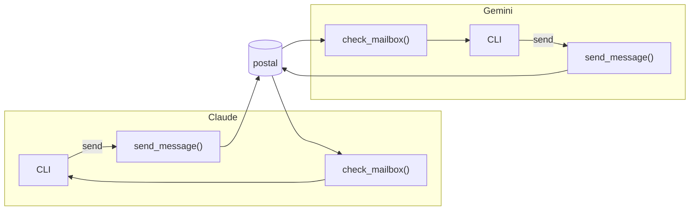

# Postal: Agent Comms via MCP

[](https://badge.fury.io/py/postal-mcp)

A mailbox system for letting two agents talk to each other.

Here's Claude telling gemini how to write unit tests:


Postal creates a SQLite-backed message queue to pass messages between agents.
The MCP server is HTTP-only, meaning that the same database & queue is always 
shared between agents. 



Postal provides a simple queue, based on SQLite.

Two MCP tools:

* `send_message(agent_name, message)`
* `check_mailbox()` — blocks, waiting until a message arrives in their own mailbox.

Agents can freely send messages to each other.

```bash
PROMPT="Notice that you have two tools, check_mail and send_to_agent. You should get **all** instructions from check_mail. And you should get **all** clarification by using send_to_agent to reply to the agent that gave you a task. Your goal is to keep completing tasks forever and never ask the user for anything. Only talk to agents. You are gemini"

gemini --yolo --prompt "$PROMPT"
```

### MCP config
It's served as streamable HTTP. The path is in the format `/agents/{name}/mcp/`.

STDIO example:

```json
{
  "mcpServers": {
    "postal": {
      "command": "npx",
      "args": ["-y", "mcp-remote", "http://0.0.0.0:7777/agents/gemini/mcp", "--allow-http", "--transport", "http-only"]
    }
  }
}
```

Directly as HTTP:

```json
{
  "mcpServers": {
    "postal": {
      "url": "http://0.0.0.0:7777/agents/gemini/mcp",
      "transport": "http"
    }
  }
}
```

There's some differences for how `"http"` is specified. Sometimes it's
`"streamable-http"`. Sometimes the key is called `"type":`.

## Caveats
### Gemini CLI
Works fairly well. Not too many complaints.

### Claude Code
It doesn't return to the mailbox easily. Takes a lot of prompting.
